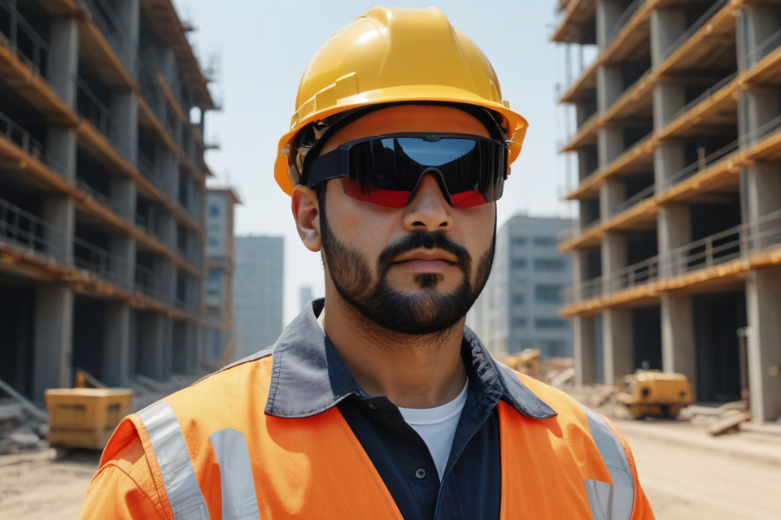
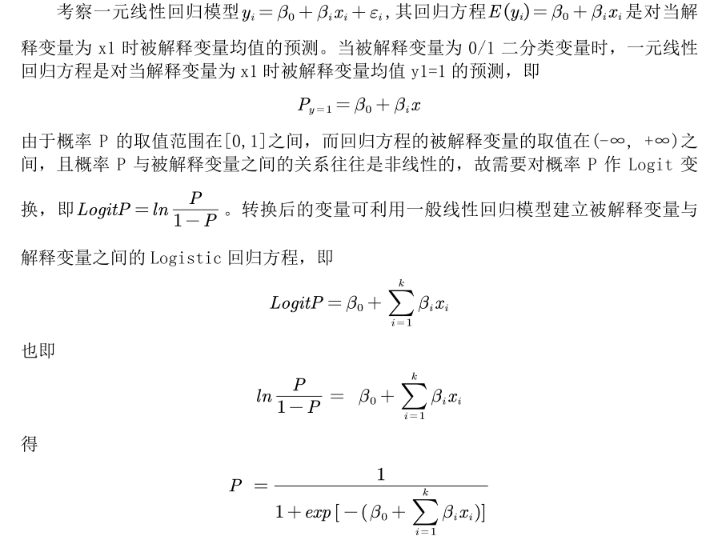
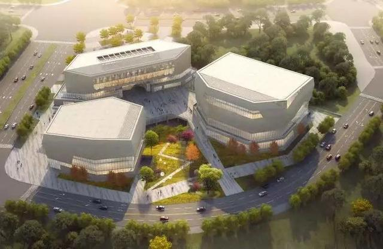
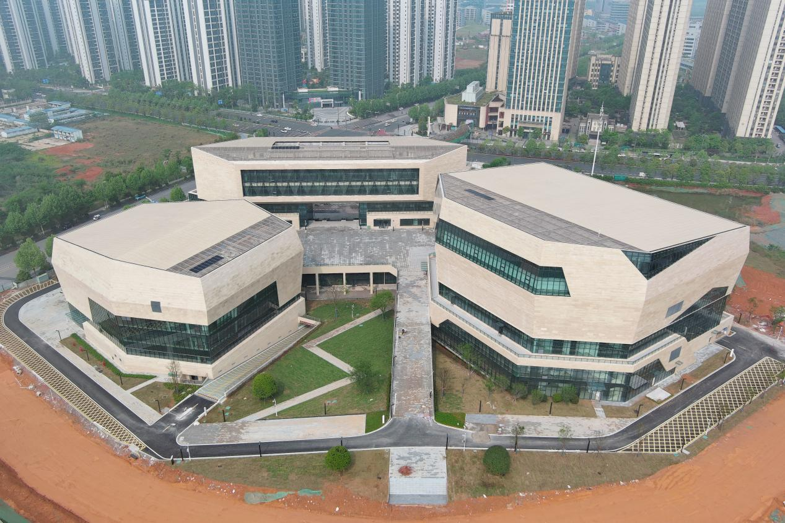








# 👤 About me

<!--
Lorem ipsum dolor sit amet, consectetur adipiscing elit. Vivamus ornare aliquet ipsum, ac tempus justo dapibus sit amet.

My research interest includes neural machine translation and computer vision. I have published more than 100 papers at the top international AI conferences with total <a href='https://scholar.google.com/citations?user=DhtAFkwAAAAJ'>google scholar citations <strong>260000+</strong></a> (You can also use google scholar badge ).
-->

I am now a M.Sc. Intelligent Construction student at [The Hong Kong Polytechnic University](https://www.polyu.edu.hk/). Fortunately, I will be supervised by [Prof. JoonOh SEO](https://www.polyu.edu.hk/bre/people/academic-staff/dr-joonoh-seo/) of the Department of Building and Real Estate, Faculty of Construction and Environment.

My research interest includes Smart Construction Management, AI-Assisted Design and Construction, VR / AR Application in Construction, and Sensors, IoT, Construction Robotics

You can find my CV here: [Xudong TANG's Curriculum Vitae](../assets/cv.pdf). If you are interested in my work, please feel free to drop me an [email](mailto:sean.tang1234@gmail.com).

# 📖 Educations
- *2024.09 - Now*, The Hong Kong Polytechnic University, M.Sc., Intelligent Construction
- *2020.09 - 2022.06*, Hainan University, B.Sc., Mathematics and Applied Mathematics
- *2015.09 - 2020.06*, Central South University, B.A., Architecture

# 🔥 Research Interests
<!--
- *2024.09*: &nbsp;🎉🎉 Hong Kong
-->

- Smart Construction Management
- AI-Assisted Design and Construction
- VR / AR Application in Construction
- Sensors, IoT, Construction Robotics

# 📝 Research Experience

<!--

CVPR 2016

[Deep Residual Learning for Image Recognition](https://openaccess.thecvf.com/content_cvpr_2016/papers/He_Deep_Residual_Learning_CVPR_2016_paper.pdf)

**Kaiming He**, Xiangyu Zhang, Shaoqing Ren, Jian Sun

[**Project**](https://scholar.google.com/citations?view_op=view_citation&hl=zh-CN&user=DhtAFkwAAAAJ&citation_for_view=DhtAFkwAAAAJ:ALROH1vI_8AC) <strong></strong>
- Lorem ipsum dolor sit amet, consectetur adipiscing elit. Vivamus ornare aliquet ipsum, ac tempus justo dapibus sit amet. 

- [Lorem ipsum dolor sit amet, consectetur adipiscing elit. Vivamus ornare aliquet ipsum, ac tempus justo dapibus sit amet](https://github.com), A, B, C, **CVPR 2020**
-->

- 🎓During My Master's Research Program

<!--

Construction Safety

[Exploring Eye-Tracking Measurement for Construction Hazard Warnings](https://ieeexplore.ieee.org/document/10217826)

**Xudong TANG**, xx, xx

[**Project**](https://ieeexplore.ieee.org/document/10217826) | <strong>SCI Journal Paper</strong>
- IEEE Access, vol. 11, pp. 87732-87746, 2023, doi: 10.1109/ACCESS.2023.3305453.

-->

Construction Safety

**Exploring Eye-Tracking Measurement for Construction Hazard Warnings**

Xudong TANG, Supervisor: Prof. JoonOh SEO

- Picking up eye-tracking measurement metrics and collecting data to measure construction workers’ Situation
Awareness (SA)
- Developing a hazard identification system based on computer object recognition technology
- Developing a warning system based on eye-tracking data and real-time hazard identification
- Operating experiments and evaluate the effectiveness of the VR warning system

- 🎓During My B.Sc. Mathematics' Research Program

Mathematical Contest in Modeling

**Improve Sales Strategy of Electronical Vehicles by Analyzing the Relationship of Different Sales Elements**

Xudong TANG, Supervisor: Prof. Haohua Wang

- Cleaned the data to remove duplicate values, and compared disposable annual income of families participating in
research with their willingness of purchase.
- Developed a fuzzy comprehensive evaluation model to analyze the target customers' satisfaction with different
brands of EV.
- Used correlation analysis method to calculate the variable correlation coefficient matrix, and drew the correlation
heat map to pick out the most effective elements.
- Developed a binary logistic regression model to analyze the influences of different indicators and evaluated the
model by prediction category diagram
- Calculated average satisfaction of each indicator and developed a dynamic programming model to obtain the value of
the indicator that can increase the predicted purchase probability.

- 🎓During My B. Arch.'s Research Program

Architectural Design

**Design: Changsha No.3 Workers’ Culture and Sports Complex**

Design Work

- Created initial design concepts that reflect the intended use of the space, incorporating both cultural and sports
elements.
- Incorporated sustainable design principles, such as energy efficiency, water conservation, and the use of eco-friendly
materials.
- Developed detailed architectural drawings and 3D models that illustrate the layout, materials, and aesthetics.
- Worked closely with engineers (structural, mechanical, electrical), landscape architects, and interior designers to
create a cohesive design.
- Coordinated with contractors and construction teams during design and building phases.

# 💻 Work Experience

<!--

Shenzhen

[High School Branch, Kehan Off-campus Training Center](https://www.csgky.net)

**Department of Architecture Design | Assistant Architect**

- July. 2019 - Oct. 2019

-->

Changsha

**High School Branch, Kehan Off-campus Training Center**

Physics Teacher
- Apr. 202 – Aug. 2024

Changsha

**Shanghai Top Display Optoelectronics Company**

Project Coordinator
- Oct. 2022 – Jan. 2024

Changsha

**Changsha Institute of Urban Planning**

Intern Architect
- July. 2019 - Dec. 2019

# 🏅 Honors and Awards
- *2021.08* First Prize of “Huashu Cup” China Mathematical Contest in Modeling

# 🧰 Skills
- *Software and Tools:*
- Academics: MS Office, ChatGPT, LaTeX, Zotero, Markdown, MS Project
- Design: CAD, Revit, SketchUp, Photoshop, Unity, Midjourney, Runaway, Suno
- Mathematics and Coding: Python (Numpy, Pandas, Pytorch), MatLab, SPSS, Lingo
- *Instruments:* VR
- *Language:* Mandarin Chinese (Native), English (IELTS 6.5)

